## 控制台接收不到HTTP报文

试图连接的时候，控制台无法接收HTTP报文，只能输出init信息和客户端异常断开的信息：

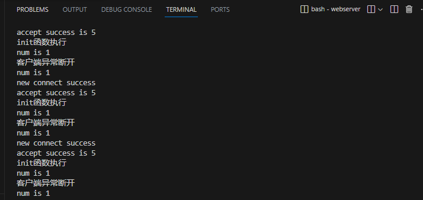

### 防火墙问题排查：（网络层）

* 考虑是否是云服务器防火墙问题。
* 首先，使用**netstat命令**查看指定的端口10000是否在监听：

```bash
netstat anp|grep 10000
```


* netstat命令相关：[【Linux netstat和ps详细使用】-anp | grep 进程 端口 PID，- tul。lsof，ps aux。ps -p 使用_ps查看进程端口号_天海华兮的博客-CSDN博客](https://blog.csdn.net/qq120631157/article/details/129865186)
* 第二步，使用**tcpdump命令**抓包，wireshark查看.cap网络通信包有没有HTTP报文：

```cpp
sudo tcpdump tcp port 10000 -n -vvv -c 1000 -w /tmp/tcpdump_save.cap
```

1. **`sudo`**：以超级用户权限运行命令。由于 `tcpdump` 需要访问网络接口，通常需要更高的权限。
2. **`tcpdump`**：是一个常用的命令行网络抓包工具。
3. **`tcp port 10000`**：指定抓取目标为 TCP 协议在端口 10000 上的所有数据包。
4. **`-n`**：告诉 `tcpdump` 不要将地址（如主机地址、端口号）转换成名字。这可以减少查找 DNS 名称所需的时间，加快抓包过程。
5. **`-vvv`**：表示增加详细输出。`vvv` 提供了更多详细信息，有助于深入分析数据包。
6. **`-c 1000`**：限制抓包的数量为 1000 个数据包。在达到这个数量后，`tcpdump` 将停止抓包。
7. **`-w /tmp/tcpdump_save.cap`**：指定抓取的数据包将被写入到 `/tmp/tcpdump_save.cap` 文件中。这个文件可以用 Wireshark 等工具进行详细分析。

确保在运行此命令时，**端口号 `10000` 是你想监控的端口，并且有足够的权限写入 `/tmp/tcpdump_save.cap` 文件**。如果你正在调试的服务器正在监听端口 10000，并且正在发生数据传输，这个命令可以帮助你捕获传输的数据包以进行进一步分析。

* 此时，如**果浏览器发送了 HTTP 请求报文，即使服务器端没有收到这些报文，它们仍然可以被 `tcpdump` 这样的抓包工具捕获到**。

* 这是因为 `tcpdump` 工作在**网络接口层级**，**可以捕获流经该网络接口的所有数据包，无论这些数据包是否被最终的应用程序（如你的服务器）成功接收**。

  使用 `tcpdump` 的好处是，它可以帮助你确定：

  - 是否真的有数据包发送到了服务器的网络接口。
  - 数据包的内容是什么，包括它们的源和目的地信息。
  - 任何潜在的网络层面的问题，比如数据包丢失、损坏或者不正确的路由。

  如果发现浏览器确实发送了数据包，但服务器没有接收到，那么问题可能出在服务器的网络配置上，或者是**服务器的应用程序（如你的 HTTP 服务器）没有正确处理这些数据包**。

wireshark打开捕捉到的网络通信包，发现是有HTTP数据的。

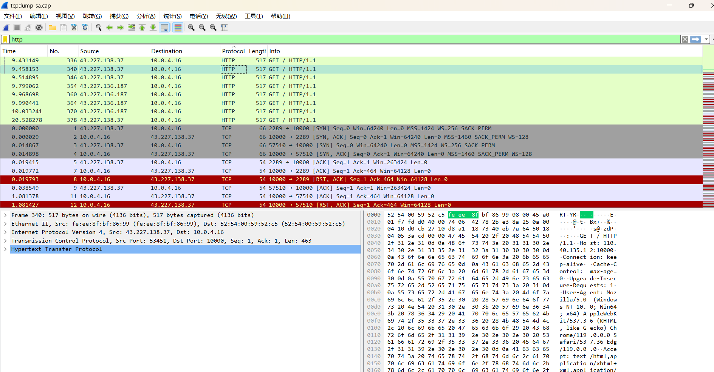

除了抓包，也可以用**Telnet命令，检测端口网络是不是通的。**

```bash
telnet 110.40.135.12 10000
```

这个命令是**使用 Telnet 客户端尝试建立一个到指定 IP 地址（110.40.135.12）上的指定端口（10000）的 TCP 连接**。这个命令通常用于测试和调试网络连接。

1. **`telnet`**：这是一个命令行工具，主要用于通过终端与远程服务器建立 TCP 连接。虽然最初用于交互式文本通信，但现在常用于测试网络连接和端口的可达性。
2. **`110.40.135.12`**：这是你想要连接的远程服务器的 IP 地址。在这个命令中，它指向某个具体的网络地址。
3. **`10000`**：这是你想要连接的端口号。端口号用于在单个主机上区分不同的网络服务。在这个例子中，你正在尝试连接到远程主机上的 10000 端口。

**使用场景**

- **测试端口开放情况**：如果你想检查 IP 地址 110.40.135.12 上的 10000 端口是否开放，可以使用此命令。如果连接成功，意味着该端口是开放的，可以接受连接。如果连接失败，可能意味着端口关闭，或者网络间存在阻塞（如防火墙规则）。

- **简单的网络调试**：Telnet 客户端还可以用于进行基本的网络调试。例如，你可以通过它发送原始的 HTTP 请求（如果目标端口是 HTTP 服务）来查看响应。

**注意事项：**

  - **安全性**：由于 Telnet 传输的数据（包括密码）不加密，因此不建议在生产环境中使用 Telnet 进行敏感通信。
  - **替代工具**：对于安全性更高的需求，可以使用如 SSH（安全外壳协议）之类的工具来代替 Telnet。

 最后，使用 Telnet 命令时，确保目标 IP 地址和端口是有权限访问的。未经授权尝试访问可能违反相关法律法规。

**telnet执行结果：**

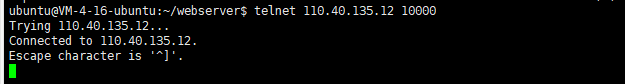

出现了这个结果，就说明远**程服务器在 10000 端口上监听并接受了你的连接请求。**说明**端口是正常开放的**。

结合之前 `tcpdump` 抓包的结果，确认了服务器收到了 HTTP 请求。这意味着网络层面的通信是成功的，浏览器发出的数据已经到达了服务器端。

1. **端口是开放的**：**Telnet 成功连接到指定的 IP 地址和端口表明该端口是开放的，且没有防火墙阻止 Telnet 客户端的连接**。
2. **服务器接收到数据**：tcpdump 抓包工具确认**服务器接收到了 HTTP 请求**，这表明**数据已经成功到达了服务器的网络接口层面**。
3. **应用层处理**：由于**服务器端显示了 `accept` 和 `init` 函数的执行，这意味着服务器的应用层也接受了连接**。如果在这之后没有进一步的处理或响应输出，**问题可能出现在应用层面上，而不是网络层面**。

这些信息表明，至少从网络连接的角度来看，数据确实到达了服务器，并且**服务器的网络栈接受了这些数据包**。现在的问题可能出现在服务器应用程序的处理逻辑上，可能是在读取、解析请求或者准备响应时出现了问题。

#### iptables命令

实际上查看防火墙最快的命令似乎还是iptables。

```bash
sudo iptables -nvL
```

执行该命令输出结果：

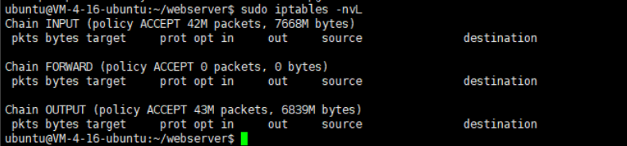

- **Chain INPUT** (policy ACCEPT 42M packets, 7668M bytes) 这表示**所有进入（INPUT）该服务器的数据包都被默认接受（ACCEPT）**。总共有大约42百万个数据包和7668兆字节的数据被接收。
- **Chain FORWARD** (policy ACCEPT 0 packets, 0 bytes) **这表示该服务器没有转发任何数据包（FORWARD）**，这是因为**在典型的服务器设置中，服务器不会转发数据包，除非它被配置为路由器或防火墙**。
- **Chain OUTPUT** (policy ACCEPT 43M packets, 6839M bytes) **这表示所有从服务器发出（OUTPUT）的数据包都被默认接受**。总共有大约43百万个数据包和6839兆字节的数据被发送。

这个输出表明，目前 `iptables` 没有设置任何阻止数据包的规则，至少在默认的策略层面上是这样。数据包可以自由进入和离开服务器，没有被 `iptables` 防火墙拦截。

这可能意味着， `iptables` 防火墙规则不太可能是造成问题的原因。


#### ⭐关于通信中的网络层、传输层应用层

**tcpdump 抓包工具**能够抓到HTTP报文，确认服务器接收到了 HTTP 请求，这表明**数据已经成功到达了服务器的网络接口层面**。

`tcpdump` 工作在网络接口层，**如果 `tcpdump` 显示了到达服务器端口的数据包，这意味着数据已经到达了服务器的网络层**，并且应该由**传输层的 TCP 协议栈**进行处理。

在一般的服务器应用程序中，**处理 TCP 连接的逻辑通常不需要直接编写 TCP 处理函数，因为这一部分由操作系统内核的网络栈来管理**。当服务器程序调用如 `socket()`, `bind()`, `listen()`, `accept()` 等系统调用时，它实际上是**在使用 TCP/IP 协议栈提供的功能**。

以下是 TCP/IP 协议栈在服务器中的典型工作流程：

1. **监听端口**：使用 `listen()` 在特定端口上监听传入的连接。
2. **接受连接**：当客户端尝试连接时，`accept()` 返回一个新的 socket 文件描述符，这个描述符代表了与客户端的已建立连接。
3. **读取数据**：通过连接的 socket 文件描述符，可以使用 `read()`、`recv()` 或类似的系统调用来从 TCP 连接中读取数据。
4. **处理数据**：一旦读取了数据，服务器程序就可以处理这些数据，比如解析 HTTP 请求。
5. **发送响应**：处理完数据后，服务器程序可以使用 `write()`、`send()` 或类似的系统调用来通过 TCP 连接发送响应。

* 注意，**通过连接的 socket 文件描述符**，可以使用 read()、recv() 或类似的系统调用来从 TCP 连接中读取数据，这里就是**应用层**的内容了

当**服务器程序使用 `socket()` 创建一个套接字并通过 `accept()` 接受了一个新的连接之后**，它会得到一个**新的文件描述符（通常称为连接套接字）**。这个**文件描述符fd**是**在应用层与特定客户端通信的句柄**。

我们可以**通过这个文件描述符使用 `read()`、`recv()` 等系统调用来从 TCP 连接中读取数据，这些都是在应用层进行的操作**。

应用层代码负责以下工作：

- **数据接收**：使用 `read()` 或 `recv()` 等调用来接收从客户端发送过来的原始数据。
- **数据解析**：应用层逻辑解析这些原始数据，例如解析 HTTP 请求头和正文。
- **业务逻辑处理**：根据解析出的信息（如 URL、HTTP 方法等），执行相应的业务逻辑。
- **响应发送**：处理完请求后，使用 `write()` 或 `send()` 等调用来向客户端发送响应。

整个过程是在应用层完成的，而底层的网络通信细节（如 TCP 三次握手、数据分段、确认和重传机制等）都由操作系统的 TCP/IP 协议栈处理，对于应用层是透明的。

服务器程序只需要关注如何读取、处理请求和发送响应即可。

### 服务器逻辑排查：位运算

排查完毕不是防火墙的问题，但是客户端还是异常断开：

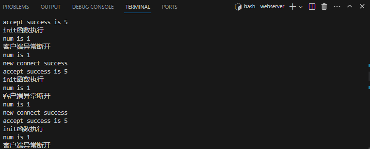

这里直接去看对应的语句块，发现是位运算的问题。

原始语句块，定义了客户端的几个异常事件：

```cpp
//最开始的问题出在这里！因为&运算优先级高于|运算优先级，&会被先计算，也就是（events[i].events& EPOLLRDHUP）|信号，这个基本上永远是true。
else if(events[i].events& EPOLLRDHUP|EPOLLHUP|EPOLLERR){//不是监听描述符，是已有的客户端描述符,开始判断事件
//客户端异常断开/错误等事件，此时关闭fd，关闭连接
	printf("客户端异常断开\n");
	users[sockfd].close();//这里传入的是sockfd，因为之前在数组里获取的就是sockfd
}
```

在 `epoll` 的事件系统中，`EPOLLRDHUP`、`EPOLLHUP` 和 `EPOLLERR` 有特定的含义：

1. **`EPOLLRDHUP`**（Stream socket peer closed connection, or shut down writing half of connection.）：这个事件表示**对端的套接字已经关闭了连接，或者关闭了它的写半部分**。在 TCP 连接中，这通常意味着客户端已经执行了关闭操作（如调用了 `close` 函数）。
2. **`EPOLLHUP`**（Hang up happened on the associated file descriptor.）：表示**挂起事件发生在关联的文件描述符上**。这个事件通常是指套接字已经不再连接了，无论是由于网络问题，还是对端关闭了连接。
3. **`EPOLLERR`**（Error condition happened on the associated file descriptor.）：表示**在关联的文件描述符上发生了错误条件。这个事件标志着套接字上出现了某种错误**。

- 如果是 `EPOLLRDHUP`，客户端已经关闭了连接，或至少关闭了写操作。
- 如果是 `EPOLLHUP`，**连接已经不活跃，可能是因为连接丢失或是对端关闭。**
- 如果是 `EPOLLERR`，表示**在这个连接上发生了错误**。

但是我们原本的这种写法有问题，因为&运算的优先级高于|运算。

所以，当我们写：

```cpp
else if (events[i].events & EPOLLRDHUP | EPOLLHUP | EPOLLERR)
```

实际上，由于运算符的优先级，这个条件被解释为：

```cpp
else if ((events[i].events & EPOLLRDHUP) | EPOLLHUP | EPOLLERR)
```

这意味着首先 `events[i].events & EPOLLRDHUP` 被计算，然后结果与 `EPOLLHUP` 进行按位或操作，然后再与 `EPOLLERR` 进行按位或操作。

**这几乎总是会返回一个非零值（表示 `true`），因为 `EPOLLHUP` 和 `EPOLLERR` 是非零常量!**因此，这个条件实际上总是 `true`，无论 `events[i].events` 中是否真的设置了 `EPOLLRDHUP`、`EPOLLHUP` 或 `EPOLLERR`。

因此，这里必须加上括号来保证||运算符先执行。如下：

```cpp
else if ((events[i].events & EPOLLRDHUP) || (events[i].events & EPOLLHUP) || (events[i].events & EPOLLERR))
```

这样才能确保只有在 `events[i].events` 中确实设置了 `EPOLLRDHUP`、`EPOLLHUP` 或 `EPOLLERR` 其中之一时，整个条件才会评估为 `true`。

修改这个if条件之后，控制台就能正确读取http报文了。可以看到最后是有空行的，**隔绝请求头和请求体**。

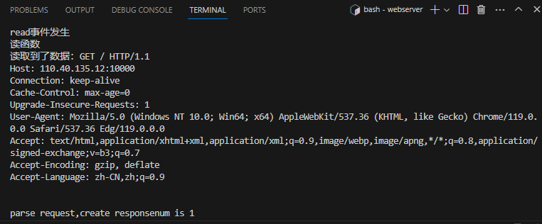

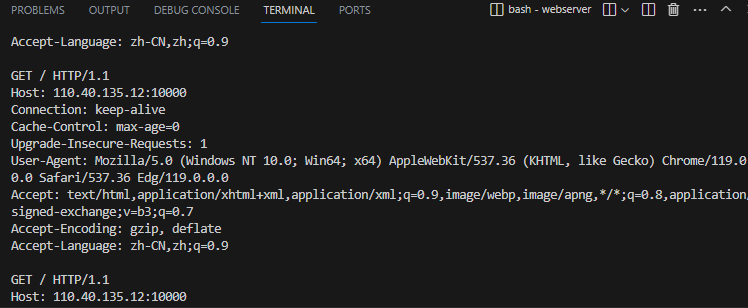

并且发现，在挂着梯子的时候，实际上也是有数据的。但是HTTP数据格式似乎有一些问题，应该是梯子转跳太多的原因。

且挂梯子的情况下连接不稳定，会时不时输出“客户端异常断开”信息，也就是上面提到的三个事件。

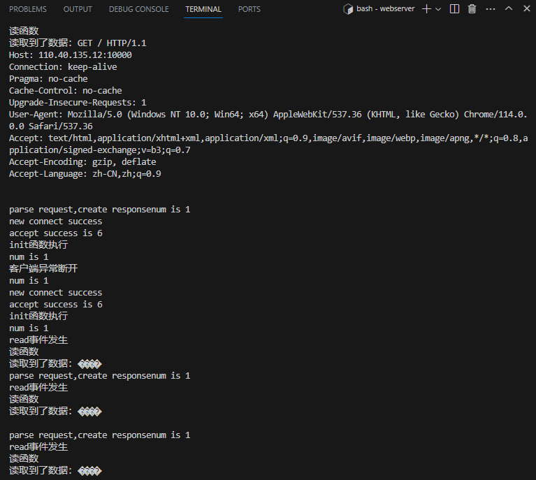

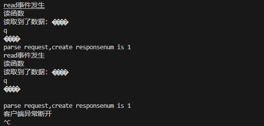


## 发送了无效的响应

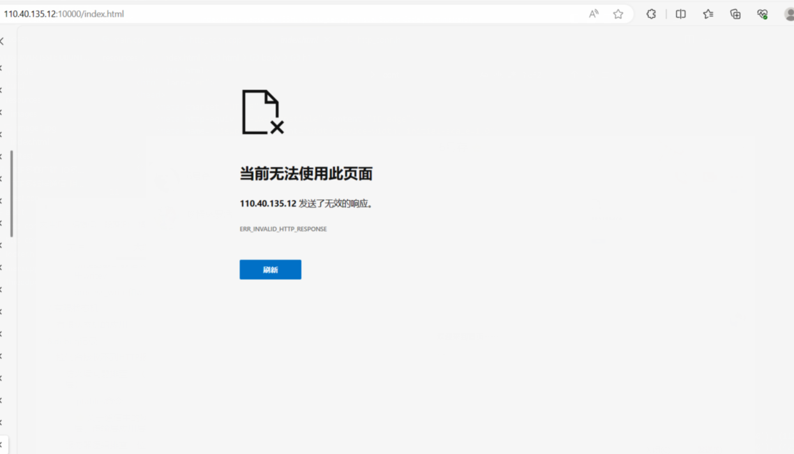


## 图片无法显示

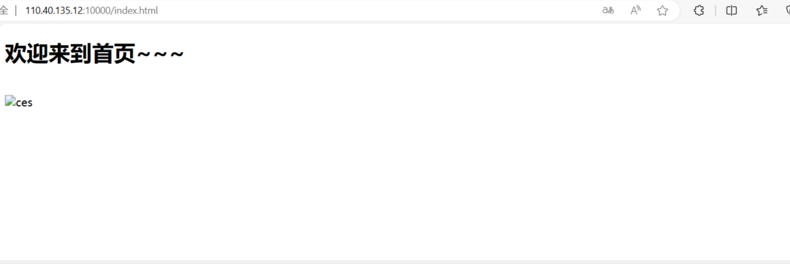

### 问题排查

首先使用tcpdump进行抓包，看看seq和ack有没有不连贯、数据包有没有不连续和重复or断发的问题：

```

```

但是其实发现tcpdump得到的结果是正确的，没有断发，seq和ack也能对的上。tcpdump是工作在网络层的，排除了发送的问题，继续排查网络层的writev函数。（也就是将数据写入缓冲区的函数）

#### writev函数排查

我们在write函数前后加上了发送字节的打印：

```cpp
//一次性写完数据，写HTTP响应
bool http_conn::write(){
    printf("一次性写完数据");
   int temp = 0;
    int bytes_have_send = 0;    // 已经发送的字节
    //问题出在bytes_to_send的初始化这里，m_write_idx只包含响应头部，不包含响应体的内容
    int bytes_to_send = m_write_idx;// 将要发送的字节 （m_write_idx）写缓冲区中待发送的字节数
    
    if ( bytes_to_send == 0 ) {
        // 将要发送的字节为0，这一次响应结束。
        modfd( m_epollfd, m_sockfd, EPOLLIN ); 
        init();
        return true;
    }
    // 打印响应内容（用于调试）
    //这里只是打印了响应头的内容，也就是存储在m_write_buf中的内容，可能不会显示出问题，
    //因为响应体（文件内容）是通过内存映射存储在另一个位置的。
    // printf("HTTP Response:\n%s", m_write_buf);
    printf("Before sending, bytes to send: %d, bytes have sent: %d\n", bytes_to_send, bytes_have_send);

    while(1) {
        // 分散写
        //writev 允许您同时写入多个非连续的内存缓冲区。
        //这意味着如果 HTTP 响应被分散在多个缓冲区中（例如，一个缓冲区用于头部，另一个用于主体），
        //可以使用单个 writev 调用将它们全部发送，而不需要多次调用 write。
        temp = writev(m_sockfd, m_iv, m_iv_count);
        if ( temp <= -1 ) {
            // 如果TCP写缓冲没有空间，则等待下一轮EPOLLOUT事件，虽然在此期间，
            // 服务器无法立即接收到同一客户的下一个请求，但可以保证连接的完整性。
            if( errno == EAGAIN ) {
                modfd( m_epollfd, m_sockfd, EPOLLOUT );
                return true;
            }
            unmap();
            return false;
        }
        bytes_to_send -= temp;
        bytes_have_send += temp;

        printf("After sending, bytes to send: %d, bytes have sent: %d\n", bytes_to_send, bytes_have_send);

        if ( bytes_to_send <= bytes_have_send ) {
            // 发送HTTP响应成功，根据HTTP请求中的Connection字段决定是否立即关闭连接
            unmap();
            if(m_linger) {
                init();
                modfd( m_epollfd, m_sockfd, EPOLLIN );
                return true;
            } else {
                modfd( m_epollfd, m_sockfd, EPOLLIN );
                return false;
            } 
        }
    }

}
```

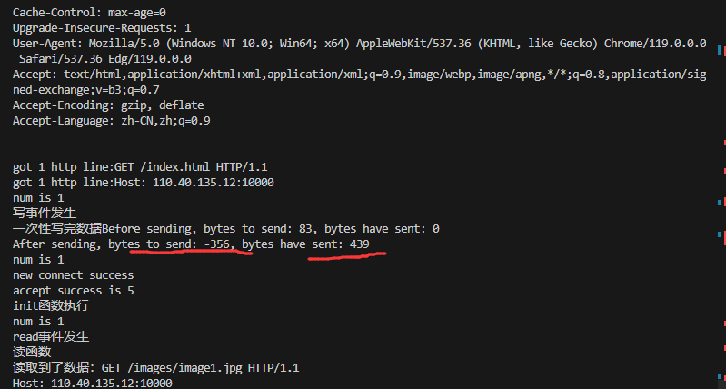

发现，bytes_to_send里面出现了负数。

`bytes_to_send` 变成负数的原因是，因为**它被错误地初始化为只包含响应头的大小**，**即 `m_write_idx` 的值**。

然而，在实际发送过程中，**使用 `writev` 函数同时发送了响应头和响应体**，这导致**发送的总字节数远远超过了仅包含响应头大小的 `bytes_to_send` 初始值**。

具体来说，错误的发送逻辑如下：

1. `bytes_to_send` 初始化为 `m_write_idx`，这只代表了响应头的大小。
2. 使用 `writev` 函数发送数据时，它不仅发送了响应头（`m_write_buf` 中的内容），还发送了响应体（即文件内容，存储在另一个缓冲区中）。
3. 发送后，**`bytes_to_send` 减去了实际发送的总字节数，这包括了响应头和响应体**。由于响应体的大小未被计入 `bytes_to_send` 的初始值，所以减去这些额外的字节后，`bytes_to_send` 变成了负数。

这个问题的根源在于 **`bytes_to_send` 未能正确地反映出整个响应（包括头和体）的大小**。正确的逻辑应该是在初始化 `bytes_to_send` 时，将响应头和响应体的大小相加，确保它代表了整个HTTP响应的大小。这样，在执行 `writev` 操作后更新 `bytes_to_send`，它将正确地逐步减少并最终归零，表示所有数据都已正确发送。

#### 为什么bytes_to_send初始化错误会导致图片发送失败？

在HTTP服务器的上下文中，`bytes_to_send` 这个变量的作用是跟踪还有多少字节的响应数据需要发送给客户端。这包括HTTP响应的头部和主体（例如HTML文件、图片等）。正确管理这个变量对于确保整个响应被完整发送是非常重要的。

**`bytes_to_send` 初始化的作用**

`write` 函数中，`bytes_to_send` 和 `bytes_have_send` 是用来管理响应数据发送的关键变量。这两个变量确保整个HTTP响应（包括头部和主体）被完整地发送到客户端。让我们来分析一下它们的作用和如何影响发送过程：

1. **`bytes_to_send`**：**这个变量代表还有多少字节的数据需要发送。它应该被初始化为整个HTTP响应的大小（即头部和主体的总大小）**。在发送过程中，每次成功调用 `writev` 后，这个值应减去实际发送的字节数。
2. **`bytes_have_send`**：这个变量**跟踪已经发送的字节总数。每次调用 `writev` 后，发送的字节数会加到这个变量上**。
3. **发送循环**（`while(1)`）：这个循环持续进行，直到所有的数据都被发送。在每次循环中，`writev` 被调用以发送数据。如果 `writev` 返回 `-1` 并且 `errno` 设置为 `EAGAIN`，这表明TCP写缓冲区已满，服务器需要等待下一个可写事件 (`EPOLLOUT`) 再继续发送。否则，`writev` 返回的是这次调用成功发送的字节数。
4. **更新 `bytes_to_send` 和 `bytes_have_send`**：每次成功发送数据后，`bytes_to_send` 减去发送的字节数，`bytes_have_send` 增加相同的数量。
5. **结束条件**：当 `bytes_to_send` 减到零或以下时，这意味着所有数据都已发送，因此可以结束发送过程。

在原始的代码中，**由于 `bytes_to_send` 只被初始化为响应头的大小，**它不足以覆盖整个响应的大小（包括主体）。因此，**在发送了头部后，即使主体还没有完全发送，`bytes_to_send` 也可能变成零或负数，导致函数错误地认为所有数据都已经发送完毕**。这就是为什么修改后的代码中正确地初始化 `bytes_to_send` 是很重要的，它确保了响应体（如图片）也被包括在发送过程中。

**为什么网页文字发送成功？**

在HTTP响应中，响应头和响应体是分开的。响应头包含了诸如状态码、内容类型等信息，而响应体则包含了实际的内容数据，比如HTML文本或图片。

在这种情况中，响应头（包括HTML中的文本）可能已经完整地发送了，因为它们的大小没有超过错误初始化的 `bytes_to_send` 值。然而，对于更大的响应体（如图片），由于 `bytes_to_send` 的值不足以覆盖整个体的大小，所以它们没有被完全发送。

#### 为什么tcpdump没有排查出来这个问题

但是，还是不明白，bytes_to_send初始化错误这样的问题，为什么tcpdump抓包的时候，seq和ack，数据包的长度看起来都没有问题？

简单查了一下，归结如下：

**实际上，即使 `bytes_to_send` 初始化错误，`tcpdump` 抓包结果可能仍然显示正常的序列号（seq）、确认号（ack）和数据包长度**。这是因为：

1. **TCP层和应用层的不同**：`tcpdump` 工作在网络层（TCP层），而 `bytes_to_send` 的问题存在于应用层。`tcpdump` 捕捉的是经过TCP层处理后的数据包，它反映了TCP协议栈的状态，而不直接反映应用层逻辑。

2. **TCP分段**：TCP协议负责将应用层的数据分段并发送。**即使应用层（如web服务器）没有发送完整的响应数据，TCP仍然会将已提供的数据分成合适大小的段并传输**。

   这意味着，每个TCP段的**seq和ack号是正确的**，与应用层逻辑是否正确无关。

3. **TCP数据包长度**：`tcpdump` 显示的每个数据包长度，是**根据TCP协议发送的实际数据长度**，与应用层逻辑无关。**即使应用层逻辑错误地认为已经发送了所有数据，TCP仍然按照实际接收到的数据来发送数据包**。

因此，尽管 `bytes_to_send` 的错误导致应用层未能发送完整的HTTP响应，`tcpdump` 抓包结果仍然可能显示正常的TCP通信过程。这种情况下，问题的根源不在于TCP协议层，**而是在于应用层的数据管理逻辑**。要诊断这类问题，通常需要结合应用层的日志、调试输出以及代码审查来进行。

### 解决方案

* 应用层逻辑里面修改bytes_to_send的赋值，加上响应体的长度

http_conn.h类里面增加：

```cpp
int bytes_to_send;              // 将要发送的数据的字节数
int bytes_have_send;            // 已经发送的字节数
```

初始化函数增加：

```cpp
void http_conn::init()
{

    bytes_to_send = 0;
    bytes_have_send = 0;
    //……
}
```

原本的process_write：

```cpp
bool http_conn::process_write(HTTP_CODE ret) {
    switch (ret)
    {
        //……
        case FILE_REQUEST:
            add_status_line(200, ok_200_title );
            // 现在根据请求的文件设置 Content-Type
            //add_content_type(m_real_file);
            add_headers(m_file_stat.st_size);
            m_iv[ 0 ].iov_base = m_write_buf;
            m_iv[ 0 ].iov_len = m_write_idx;
            m_iv[ 1 ].iov_base = m_file_address;
            m_iv[ 1 ].iov_len = m_file_stat.st_size;
            m_iv_count = 2;
            return true;
        default:
            return false;
    }

    m_iv[ 0 ].iov_base = m_write_buf;
    m_iv[ 0 ].iov_len = m_write_idx;
    m_iv_count = 1;

    
    return true;
}
```

修改后的process_write：

```cpp
// 根据服务器处理HTTP请求的结果，决定返回给客户端的内容
bool http_conn::process_write(HTTP_CODE ret) {
    switch (ret)
    {
       //……
        case FILE_REQUEST:
            add_status_line(200, ok_200_title );
            add_headers(m_file_stat.st_size);
            m_iv[ 0 ].iov_base = m_write_buf;
            m_iv[ 0 ].iov_len = m_write_idx;
            m_iv[ 1 ].iov_base = m_file_address;
            m_iv[ 1 ].iov_len = m_file_stat.st_size;
            m_iv_count = 2;

            bytes_to_send = m_write_idx + m_file_stat.st_size;//之前没有这一步，文件准备完成之后，要初始化bytes_to_send变成响应头+响应体

            return true;
        default:
            return false;
    }
```

原本的write：

```cpp
//一次性写完数据
// 写HTTP响应
bool http_conn::write(){
    printf("一次性写完数据");
   int temp = 0;
    int bytes_have_send = 0;    // 已经发送的字节
    int bytes_to_send = m_write_idx;// 将要发送的字节 （m_write_idx）写缓冲区中待发送的字节数
    
    if ( bytes_to_send == 0 ) {
        // 将要发送的字节为0，这一次响应结束。
        modfd( m_epollfd, m_sockfd, EPOLLIN ); 
        init();
        return true;
    }
    // 打印响应内容（用于调试）
    printf("HTTP Response:\n%s", m_write_buf);

    while(1) {
        // 分散写
        //writev 允许您同时写入多个非连续的内存缓冲区。
        //这意味着如果 HTTP 响应被分散在多个缓冲区中（例如，一个缓冲区用于头部，另一个用于主体），
        //可以使用单个 writev 调用将它们全部发送，而不需要多次调用 write。
        temp = writev(m_sockfd, m_iv, m_iv_count);
        if ( temp <= -1 ) {
            // 如果TCP写缓冲没有空间，则等待下一轮EPOLLOUT事件，虽然在此期间，
            // 服务器无法立即接收到同一客户的下一个请求，但可以保证连接的完整性。
            if( errno == EAGAIN ) {
                modfd( m_epollfd, m_sockfd, EPOLLOUT );
                return true;
            }
            unmap();
            return false;
        }
        bytes_to_send -= temp;
        bytes_have_send += temp;
        if ( bytes_to_send <= bytes_have_send ) {
            // 发送HTTP响应成功，根据HTTP请求中的Connection字段决定是否立即关闭连接
            unmap();
            if(m_linger) {
                init();
                modfd( m_epollfd, m_sockfd, EPOLLIN );
                return true;
            } else {
                modfd( m_epollfd, m_sockfd, EPOLLIN );
                return false;
            } 
        }
    }

}

```

修改后的write：

```cpp
// 写HTTP响应
bool http_conn::write()
{
    int temp = 0;
    if ( bytes_to_send == 0 ) {
        // 将要发送的字节为0，这一次响应结束。
        modfd( m_epollfd, m_sockfd, EPOLLIN ); 
        init();
        return true;
    }
    while(1) {
        // 分散写
        temp = writev(m_sockfd, m_iv, m_iv_count);
        if ( temp <= -1 ) {
            // 如果TCP写缓冲没有空间，则等待下一轮EPOLLOUT事件，虽然在此期间，
            // 服务器无法立即接收到同一客户的下一个请求，但可以保证连接的完整性。
            if( errno == EAGAIN ) {
                modfd( m_epollfd, m_sockfd, EPOLLOUT );
                return true;
            }
            unmap();
            return false;
        }
        bytes_have_send += temp;
        bytes_to_send -= temp;
        if (bytes_have_send >= m_iv[0].iov_len)
        {
            m_iv[0].iov_len = 0;
            m_iv[1].iov_base = m_file_address + (bytes_have_send - m_write_idx);
            m_iv[1].iov_len = bytes_to_send;
        }
        else
        {
            m_iv[0].iov_base = m_write_buf + bytes_have_send;
            m_iv[0].iov_len = m_iv[0].iov_len - temp;
        }
        if (bytes_to_send <= 0)
        {
            // 没有数据要发送了
            unmap();
            modfd(m_epollfd, m_sockfd, EPOLLIN);
            if (m_linger)
            {
                init();
                return true;
            }
            else
            {
                return false;
            }
        }
    }
}
```

修改之后问题解决


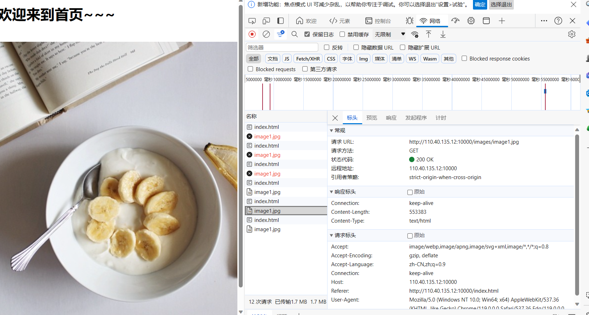

# 9.定时删除非活跃连接

运行noactive文件夹下的./a.out 10000

再打开一个终端，使用telnet命令连接110.40.135.12 10000

```bash
telnet 110.40.135.12 10000
```

终端输出结果如下，说明连接成功。